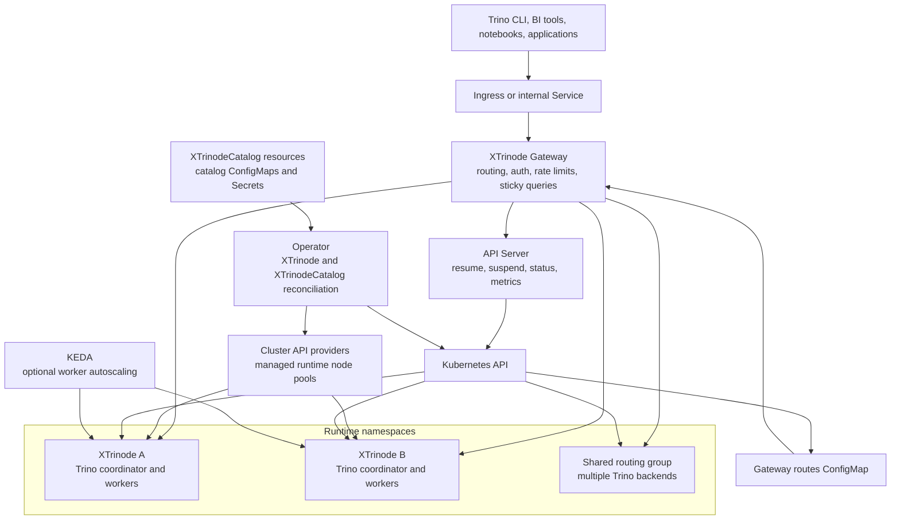
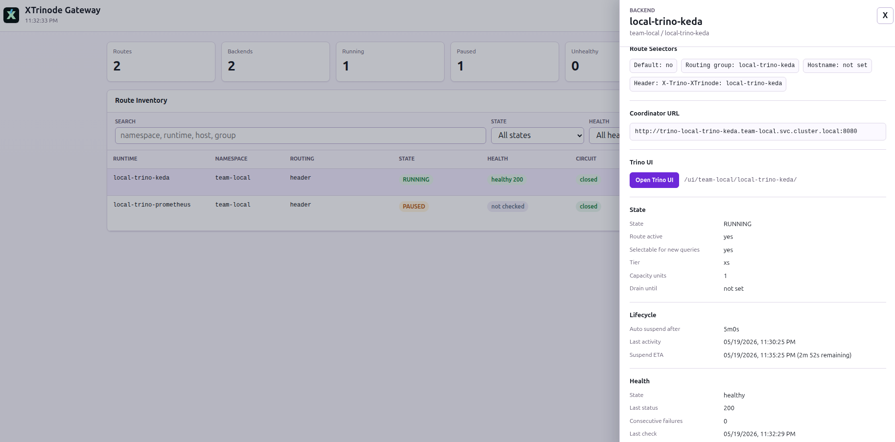

<p align="center">
  <a href="https://xtrinode.dev">
    
  </a>
</p>

<p align="center">
  See the <a href="docs/DEPLOYMENT.md">deployment guide</a> and
  <a href="docs/ARCHITECTURE.md">architecture documentation</a> for deployment
  instructions and end user documentation.
</p>

<p align="center">
  <a href="https://github.com/xtrinode/xtrinode/releases">XTrinode download</a>
  &nbsp;|&nbsp;
  <a href="docs/VERSIONING_AND_PACKAGING.md">Versioning and packaging</a>
  &nbsp;|&nbsp;
  <a href="docs/COMPATIBILITY_MATRIX.md">Compatibility matrix</a>
  &nbsp;|&nbsp;
  <a href="https://xtrinode.dev">xtrinode.dev</a>
</p>

# XTrinode

XTrinode is a Kubernetes-native control plane for
[Trino](https://github.com/trinodb/trino). It combines:

- An operator that turns `XTrinode` custom resources into isolated Trino
  coordinators, workers, Services, ConfigMaps, and status.
- A gateway that routes Trino clients by hostname, header, default route, or
  shared routing group.
- An API server that handles lifecycle operations such as suspend, resume,
  status, health, and metrics.
- Optional KEDA worker autoscaling and per-runtime node-pool isolation.
- Optional Cluster API node-pool management for provider-backed runtime compute.

XTrinode is pronounced **ex-TRY-node**. The name joins:

- The "X" of elastic execution.
- The "Tri" of Trino.
- The Kubernetes node model that makes compute disposable.

## Overview

Trino is excellent at:

- Federated SQL across many data sources.
- Lakehouse analytics.
- High-throughput distributed query execution.

Running many Trino clusters as a shared internal platform is harder because:

- Always-on clusters cost money when teams are idle.
- Busy teams can interfere with each other.
- Catalog configuration is repetitive and easy to drift.
- Kubernetes provides primitives, not a complete Trino runtime lifecycle.

XTrinode wraps Trino in a declarative Kubernetes control plane:

- Isolated `XTrinode` custom resources with their own coordinator, workers,
  catalogs, routing, and lifecycle.
- A Trino-aware gateway for hostname, header, default-route, and shared-pool
  routing.
- Suspend and resume workflows through the API server and gateway.
- Fixed worker counts by default, with optional KEDA worker autoscaling.
- Reusable `XTrinodeCatalog` resources with Secret-backed catalog credentials.
- Optional Trino fault-tolerant execution and exchange-manager configuration.
- Optional per-runtime node pools for stronger isolation, chargeback, and
  provider-backed compute lifecycle through Cluster API.

The goal is not to replace Trino. XTrinode uses Trino as the query engine and
adds the operational layer needed to make many Trino runtimes feel like an
internal analytics product instead of a collection of manually operated
clusters.

## Architecture

<p align="center">
  
</p>



## Scaling And Node Pools

XTrinode separates Trino worker scaling from infrastructure capacity:

- **Worker scaling**: fixed worker counts by default, or KEDA-managed worker
  replicas when `spec.keda.enabled=true` and a scaler is configured.
- **Horizontal node-pool scaling**: `spec.nodePool.minNodes` and
  `spec.nodePool.maxNodes` set the runtime node-pool bounds. When Cluster
  Autoscaler owns the pool, XTrinode updates autoscaler annotations and leaves
  replica count ownership to the autoscaler; without autoscaler ownership, the
  operator can patch replicas directly.
- **Vertical node-pool shape**: provider-specific fields choose the node shape,
  such as GCP `machineType`, AWS `instanceType`, Azure `vmSize`, disk type or
  size, spot settings, zones, labels, and taints. Shape changes are
  infrastructure changes and can trigger node replacement or re-provisioning.

Cluster API integration lets the operator create or update runtime node-pool
resources for managed GKE, EKS, and AKS-style providers when `spec.nodePool` is
configured. GCP/CAPG is the most exercised live path today; AWS/CAPA and
Azure/CAPZ examples exist for provider validation.

## Gateway Admin UI

The gateway includes an optional read-only admin UI at `/ui/admin` for route and
backend visibility. It shows route selectors, lifecycle state, health, circuit
breaker stats, reload metadata, and query examples.



## Comparison

XTrinode assumes Trino remains the query engine. The comparison below focuses on
the operational platform layer around Trino runtimes.

| Capability | Vanilla Trino | [Trino Gateway](https://github.com/trinodb/trino-gateway) | XTrinode |
| --- | --- | --- | --- |
| Query engine | Yes | No, proxies Trino | Uses [Trino](https://github.com/trinodb/trino) |
| Multi-runtime entrypoint | One Trino deployment per endpoint | Routes existing Trino clusters | Native `XTrinode` runtimes and routing groups |
| Runtime creation and updates | Helm or manual operations | Does not create runtimes; manages gateway backend records | Operator-managed from CRDs |
| Autosuspend runtime compute | No | No | Yes, via `spec.autoSuspendAfter` |
| Autoresume runtime compute | No | No | Yes, via gateway/API resume |
| Kubernetes-native lifecycle | Helm chart, no operator | Helm chart for gateway only; Trino lifecycle stays external | Operator-managed lifecycle |
| GitOps-friendly runtime config | Partial, via Helm values | Partial, gateway config plus backend database/API state | Yes, declarative CRDs |
| Per-runtime worker scaling | Manual | External to the gateway | Yes, fixed replicas or KEDA |
| Catalog management | Per-cluster configuration | Does not manage catalogs; routing can inspect query metadata | `XTrinodeCatalog` CRDs |
| Node-pool lifecycle | Manual node groups | External to the gateway | Optional CAPI-backed per-runtime node pools with min/max bounds and provider shapes |
| Isolation and chargeback | Manual namespaces or node pools | External to the gateway | Optional per-runtime node pools |

There are also open-source Trino operators with different control-plane models.
The table below compares XTrinode against the public operator repositories that
were reviewed:
[Stackable Trino Operator](https://github.com/stackabletech/trino-operator),
[Canonical Charmed Trino K8s Operator](https://github.com/canonical/trino-k8s-operator),
and [Meridian](https://github.com/meridian-io/meridian). Bold marks the
strongest fit for that specific row, not an overall project ranking.

| Capability | [Stackable Trino Operator](https://github.com/stackabletech/trino-operator) | [Canonical Charmed Trino K8s Operator](https://github.com/canonical/trino-k8s-operator) | [Meridian](https://github.com/meridian-io/meridian) | XTrinode |
| --- | --- | --- | --- | --- |
| Runtime model | **`TrinoCluster` CRD with coordinator and worker role groups** | Juju charm applications for coordinator, worker, or single-node mode | `Cluster`, `ClusterPool`, and `ClusterPoolAutoscaler` CRDs | `XTrinode` CRD per runtime |
| Query entrypoint | Exposes coordinator through Stackable Listener; multi-cluster routing is external | Nginx ingress relation for one Trino deployment | REST/MCP reservation, with optional Trino Gateway registration | **Built-in gateway with hostname, header, default-route, and routing-group routing** |
| Catalog model | **`TrinoCatalog` CRD selected by labels** | Juju config, secrets, and relations; PostgreSQL relation can manage dynamic catalogs | MCP dynamic catalog tools; profile templates are still evolving | `XTrinodeCatalog` CRD with Secret references |
| Scale-to-zero lifecycle | Manual `clusterOperation.stopped` scales pods to zero | Manual unit scaling; no idle autosuspend found | Pool downsizing and recycling, not idle autosuspend | **Idle autosuspend with `spec.autoSuspendAfter`** |
| Request-triggered resume | No query-path autoresume found | No query-path autoresume found | Reservation selects an idle cluster; not query-path autoresume | **Gateway/API resume for suspended runtimes** |
| Scaling focus | Role-group replica counts | Juju worker unit scaling | Autoscaling standby cluster-pool size | **Fixed workers or KEDA per runtime** |
| Kubernetes/GitOps surface | **CRDs and Helm** | Juju model and config, not native Kubernetes CRDs | CRDs plus REST/MCP APIs | CRDs, Helm, and examples |
| Isolation model | Pod configuration, resources, and affinity | Juju/Kubernetes placement outside the charm | Cluster pools and workload labels | **Optional per-runtime node-pool integration** |

## Getting Started

Start with the path that matches what you are trying to do:

- Try XTrinode locally with the k3d and Tilt workflow in
  [tilt/README.md](tilt/README.md).
- Install the platform into a cluster with the umbrella chart in
  [helm/xtrinode/README.md](helm/xtrinode/README.md).
- Deploy on GCP with the tested GKE/CAPG flow in
  [docs/DEPLOYMENT.md](docs/DEPLOYMENT.md).
- Treat AWS and Azure deployment material as experimental provider-validation
  paths until they have the same live smoke coverage as GCP.
- Create an `XTrinode` runtime from one of the manifests in
  [examples/](examples/), then
  adapt the custom resource for size, catalogs, routing, KEDA, fault-tolerant
  execution, values overlays, or node-pool requirements.
- Connect through the gateway by hostname, `X-Trino-XTrinode` header, or default
  route. Dedicated routing groups and shared pools are documented in the
  [architecture guide](docs/ARCHITECTURE.md#routing-model).
- Connector validation is intentionally scoped: PostgreSQL and Iceberg have live
  connector smoke/query coverage today. Other typed connectors have
  property-rendering unit coverage and should be validated with your target
  Trino image and backing service before production use. See
  [docs/TRINO_CATALOG_CONNECTORS.md](docs/TRINO_CATALOG_CONNECTORS.md).

## Documentation

Detailed material lives in topic-specific documents:

- [docs/ARCHITECTURE.md](docs/ARCHITECTURE.md) explains the control plane, query
  plane, gateway routing, lifecycle, scaling, overlay boundaries, and component
  responsibilities.
- [docs/DEPLOYMENT.md](docs/DEPLOYMENT.md) explains platform deployment flow.
- [docs/TROUBLESHOOTING.md](docs/TROUBLESHOOTING.md) covers day-two checks and
  common runtime failures.
- [docs/COMPATIBILITY_MATRIX.md](docs/COMPATIBILITY_MATRIX.md) documents tested
  Kubernetes, Trino, Helm, KEDA, and provider validation posture.

## Development

See [CONTRIBUTING.md](CONTRIBUTING.md) for contribution workflow,
[AGENTS.md](AGENTS.md) for repository engineering rules, and
[docs/CODEOWNERS.md](docs/CODEOWNERS.md) for ownership and release governance.

For a first development pass:

1. Install the tools in [Build Requirements](#build-requirements).
2. Run `make help` to see the maintained command surface and default variables.
3. Run `make helm-deps` before Helm, install, or local-cluster work.
4. Use focused checks while changing one area, then run broader CI targets before
   opening a pull request.
5. Use the local k3d/Tilt path for end-to-end behavior that needs a real
   Kubernetes API, KEDA, the gateway, and Trino.

Useful first commands:

```bash
make help
make helm-deps
make build-all
make lint-markdown
```

For local cluster work:

```bash
make dev-up
make test-e2e-local-smoke
make dev-down
```

Common CI-style checks:

```bash
make ci-lint
make ci-test
make ci-verify-manifests
make ci-terraform-validate-all
make ci-security
```

Run the full local e2e surface before release-impacting changes:

```bash
make test-e2e-local
make test-e2e-local-loadtest
make test-e2e-local-operator-stress
```

For a single local command that mirrors the main CI build checks, run:

```bash
make ci-build
```

Live GKE validation is intentionally separate from default CI and requires the GCP
context and credentials described in [docs/DEPLOYMENT.md](docs/DEPLOYMENT.md):

```bash
make gcp-capg-nodepool-smoke
make gcp-keda-resume-smoke
```

Repository map:

| Path | What lives there |
| --- | --- |
| [xtrinode/](xtrinode/) | Go module for the operator, API server, gateway, controllers, CRDs, and shared packages. |
| [helm/](helm/) | Helm charts for the operator, API server, gateway, umbrella install, and observability stack. |
| [examples/](examples/) | Example `XTrinode` and `XTrinodeCatalog` manifests to copy and adapt. |
| [tilt/](tilt/) | Local k3d/Tilt workflow, Robot Framework suites, Locust load tests, and local examples. |
| [terraform/](terraform/) | GCP, AWS, and Azure infrastructure modules. GCP is the fully exercised path; AWS and Azure are experimental provider-validation paths. |
| [scripts/](scripts/) | Deployment, cloud, smoke-test, CAPI, cleanup, and CI helper scripts. |
| [docs/](docs/) | Public architecture, deployment, compatibility, troubleshooting, connector, versioning, and governance docs. |
| [.github/workflows/](.github/workflows/) | CI, release, image, Terraform, and security scan workflows. |

## Build Requirements

Install the core tools for your workflow:

| Area | Tools | Notes |
| --- | --- | --- |
| Base shell | Linux or macOS, Bash, GNU Make, `curl`, `jq`, `yq` | Shell scripts and Robot suites use JSON/YAML command-line processing. |
| Go development | Go `1.26.3` | Must match `xtrinode/go.mod` and `tools/go.mod`. |
| Go tooling | `golangci-lint` `v2.12.1`, `controller-gen` `v0.20.1` | Versions are pinned in `tools/go.mod`; Make targets install or verify them where practical. |
| Containers | Docker with Buildx | Required for image builds, local registry work, k3d, and some lint fallbacks. |
| Kubernetes | `kubectl`, Helm `3.20.0` | Required for chart development and cluster deployment. |
| Local cluster loop | k3d, Tilt | Required by `make dev-up`, `make tilt-up`, and local e2e targets. |
| Python e2e | `uv`, Python `>=3.11` | `uv` manages Robot Framework and Locust from `tilt/e2e/pyproject.toml`. |
| Markdown docs | Node.js `22` or Docker | `markdownlint-cli` is pinned in `package.json`; the Makefile can use Docker as a fallback. |
| Terraform | Terraform `1.9.0`, optional `tflint` | Used for infrastructure validation and provider deployment workflows. |
| Security scans | Trivy | Required by image, filesystem, and rendered-config scan targets. |
| Cloud CLIs | `gcloud` plus `gke-gcloud-auth-plugin`; optional `aws` and `az` | GCP is the fully tested deploy path. AWS and Azure workflows exist, but remain experimental. |

## Contributing

See [CONTRIBUTING.md](CONTRIBUTING.md) for development setup, coding standards,
validation expectations, issue-reporting guidance, security-sensitive reporting,
and pull request workflow.

The best ways to support the project are to test it on real workloads, contribute
focused fixes, improve examples, document provider-specific deployment gaps, and
share production feedback about routing, scaling, catalog management, and
operational safety.

## Security

Do not publish secrets, credentials, exploit details, or sensitive cluster
configuration in public issues. Use GitHub private vulnerability reporting when
available, or contact the project maintainers directly before sharing
security-sensitive details.
