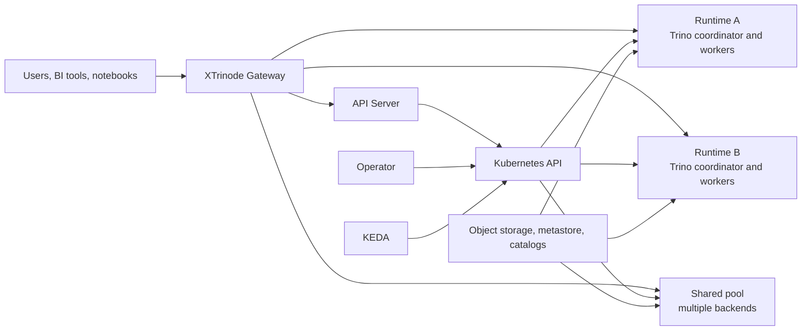
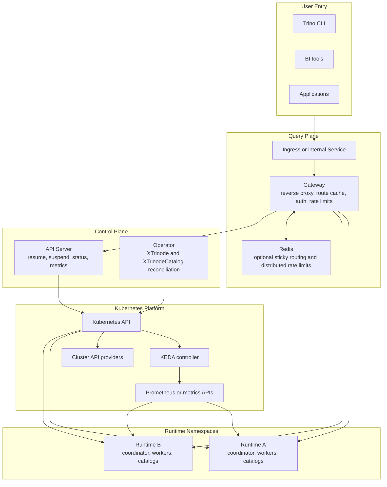
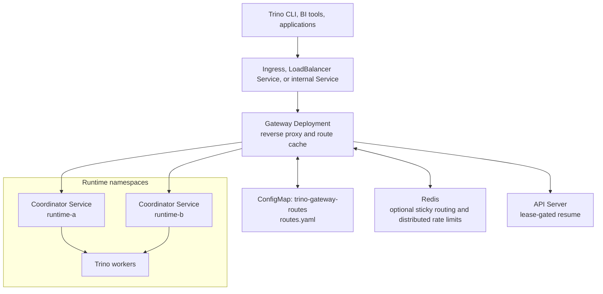
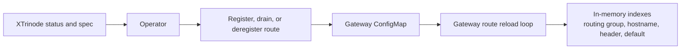
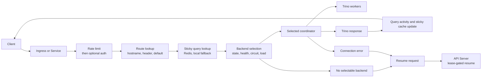
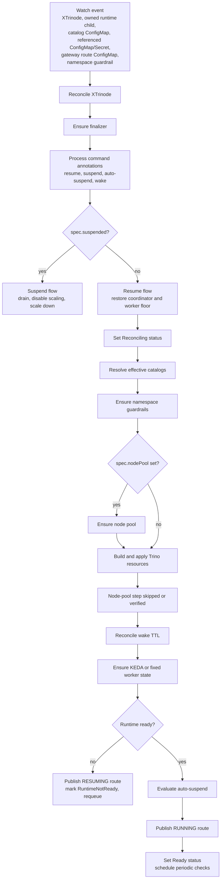
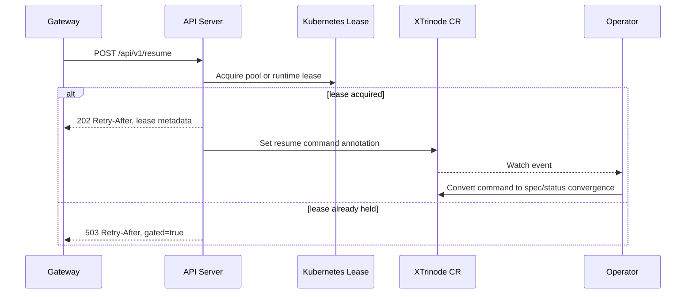
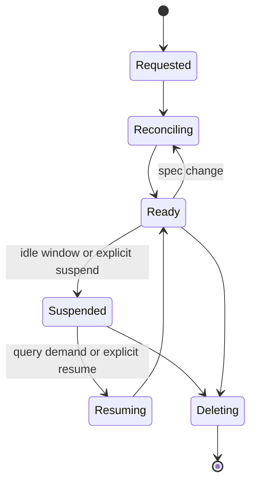
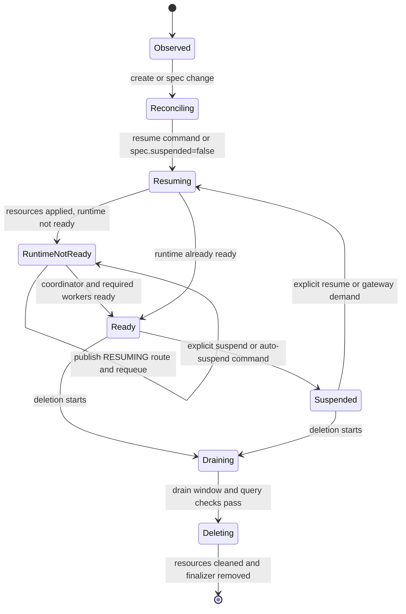
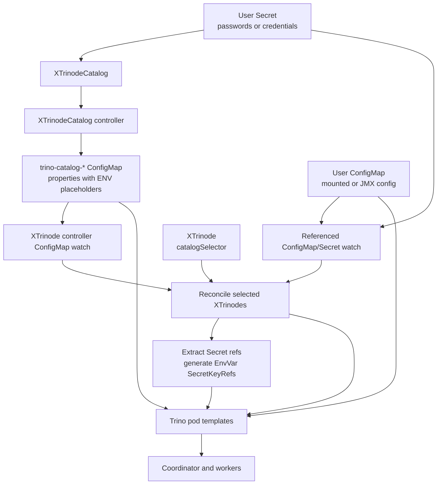

# XTrinode Architecture

This document describes how the XTrinode control plane, query plane, and generated
Kubernetes resources fit together. It is the detailed architecture companion to the
short user-facing root README.

## System Shape

XTrinode is a Trino control plane implemented as a Kubernetes operator plus
gateway and API server. It turns Kubernetes custom resources into isolated Trino
compute runtimes. The operator owns desired-state reconciliation, the API server
owns lifecycle API requests, and the gateway owns Trino-facing request routing.

At the highest level, XTrinode has a control plane that reconciles runtime intent
and a query plane that routes SQL traffic to the right Trino coordinator.





## Component Responsibilities

| Component | Owns | Notes |
| --- | --- | --- |
| Operator | Desired-state reconciliation for `XTrinode` and `XTrinodeCatalog` resources | Creates or updates Trino resources, KEDA `ScaledObject` resources, optional node-pool resources, gateway route ConfigMap entries, status, conditions, and events. |
| API Server | Internal control-plane API for lifecycle operations | Exposes runtime list/create/get/delete/status, suspend, resume, unified resume, health, and metrics endpoints. Mutating lifecycle operations are serialized with Kubernetes Lease objects. Health and metrics stay unauthenticated for probes and scraping. It is not a tenant-facing or direct end-user API. |
| Gateway | Trino query entrypoint | Routes by hostname, `X-Trino-XTrinode`, or default route; keeps sticky query routing; load-balances backends; enforces backend state, auth, rate limits, health checks, and circuit breakers. |
| KEDA | Optional worker autoscaling | Scales worker replicas from metrics when `spec.keda.enabled=true` and a concrete scaler configuration is present. Fixed worker replicas are the default. |
| Cluster API providers | Optional node-pool provisioning | Create cloud-specific node-pool resources for runtime isolation and cost attribution when `spec.nodePool` is configured. |
| `XTrinodeCatalog` | Catalog declaration | Renders connector properties into catalog ConfigMaps. XTrinode runtimes select catalogs and inject referenced Secrets into Trino pods. |

## API Server Internal Boundary

The API server is a service-to-service control-plane component. The supported posture is a
ClusterIP Service reachable from the operator, Gateway, and trusted automation on the cluster
network. Production paths should enable the admin bearer token for trusted control-plane callers and
the separate resume-only bearer token for Gateway auto-resume calls.

Do not expose the API server directly to browsers, tenants, or public users. Its bearer tokens are
coarse control-plane credentials, and tenant-aware authorization is not implemented. Any deliberate
administrative ingress exposure must use bearer auth, TLS termination, and exact non-wildcard CORS
origins, and still is not a tenant-safe API surface.

## Query Plane

The gateway is the Trino-aware reverse proxy for XTrinode runtimes. It is not a
Kubernetes Ingress controller and does not replace a cloud load balancer when
external exposure, public DNS, or TLS termination is required. In production it
normally sits behind an Ingress or internal Service and owns the application
routing decision from Trino client requests to coordinator Services.

### Gateway Runtime Shape



The gateway Deployment exposes port `8080`. The operator writes route entries to
the `trino-gateway-routes` ConfigMap in the gateway namespace. Each backend URL
is the generated coordinator Service URL for an `XTrinode`, built from the
runtime name, namespace, and configured Trino HTTP port.

### Route Ownership

The route ConfigMap is operator-owned state. The gateway only reads it.



Routes are loaded on startup and refreshed by polling the ConfigMap
`resourceVersion`. A missing `routes.yaml` key or invalid YAML keeps the
last-good in-memory routes. Structurally invalid or duplicate parsed entries are
filtered; if every parsed entry is invalid, the gateway keeps the last-good
routes instead of replacing them with an empty or broken cache.

### Request Path



Routing lookup order is:

1. Hostname route, when the request host matches a configured hostname.
2. `X-Trino-XTrinode` header route. A provided header that does not match a route
   fails instead of falling back.
3. Default route, only when no explicit selector was provided.

Health and metrics endpoints bypass authentication and rate limiting. Internally,
the gateway keeps a multi-index route cache keyed by routing group, hostname, and
header, with default-route state held separately for deterministic fallback
behavior.

### Backend Selection

Backend selection is intentionally stateful:

- Only `RUNNING` and active backends can receive new queries.
- Existing sticky query continuations can still route to `DRAINING` backends.
- Health checks and circuit breakers remove unhealthy backends from normal
  selection, with a fail-open path for ordinary health uncertainty.
- A backend freshly marked as sleeping is not fail-opened; it becomes a resume
  signal instead.
- Capacity-aware load balancing uses observed query activity when available and
  otherwise chooses the smallest capacity backend deterministically.

Auto-resume is conservative. A connection error or a route with no selectable
backend can trigger a resume request through the API server. Plain HTTP 503
responses from Trino are treated as overload or retry guidance; they do not by
themselves prove the runtime is suspended.

Load balancing is deterministic. When query activity data is available, the
gateway selects the backend with the lowest load relative to capacity units. When
there is no load data, it chooses the smallest capacity backend first. This gives
small-first behavior for shared pools and spills to larger backends as load
grows.

### Sticky Routing

Trino returns query IDs in response bodies and uses query IDs in follow-up
request paths. The gateway extracts those IDs and stores:

- namespace;
- `XTrinode` name;
- backend URL;
- routing group.

Redis is optional. When Redis is disabled or unavailable, the gateway uses a
local expiring LRU cache. When Redis is enabled, the same Redis client also backs
distributed rate limiting.

Sticky routing is cross-route by design. If a follow-up request carries a query
ID, the gateway searches all loaded routes for the cached backend so query
continuation survives selector changes. A `DRAINING` backend can still receive
sticky continuations, but cannot receive new queries.

### Ingress And Service Boundaries

Use an Ingress or `LoadBalancer` Service when clients need external access, TLS,
public DNS, or provider-specific edge integration. Use the gateway Service
directly for in-cluster clients.

| Layer | Responsibility |
| --- | --- |
| Ingress or external Service | External reachability, DNS, TLS termination, provider load balancing. |
| Gateway | Trino-aware route lookup, backend state enforcement, sticky routing, rate limits, auth, resume calls. |
| Coordinator Service | Stable Kubernetes DNS name for one runtime coordinator. |
| Coordinator and workers | Trino execution runtime. |

### Routing Model

The routing model separates user-facing request selectors from backend
membership. A routing group is the membership key; hostnames, headers, and
default routes are selectors that map a client request into that group.

| Pattern | Configuration | Result |
| --- | --- | --- |
| Dedicated runtime | Omit `spec.routing.routingGroup` | The operator derives a namespace-qualified group such as `production--runtime-a`; one backend receives traffic. |
| Shared pool | Set the same `routingGroup` on multiple runtimes | The gateway load-balances across active backends in the group. |
| Explicit hostname | Set `spec.routing.hostname` | The public route uses the provided hostname instead of a generated one. |
| Generated hostname | Set `spec.routing.hostnameDomain` | The operator creates `<routing-group>.<domain>`. |
| Header route | Use the default `X-Trino-XTrinode: namespace/name` selector or configured header value | Useful when one gateway hostname fronts many runtimes. |
| Default route | Set `spec.routing.default: true` | Fallback only when no hostname or header selector matched. |

Dedicated runtime example:

```yaml
apiVersion: analytics.xtrinode.io/v1
kind: XTrinode
metadata:
  name: runtime-a
  namespace: production
spec:
  size: m
  routing:
    hostnameDomain: trino-gw.company.com
```

This produces the `production--runtime-a` routing group and, with the example
domain, a `production--runtime-a.trino-gw.company.com` hostname.

Shared pool example:

```yaml
apiVersion: analytics.xtrinode.io/v1
kind: XTrinode
metadata:
  name: runtime-shared-1
  namespace: production
spec:
  size: m
  routing:
    routingGroup: shared
    hostnameDomain: trino-gw.company.com
---
apiVersion: analytics.xtrinode.io/v1
kind: XTrinode
metadata:
  name: runtime-shared-2
  namespace: production
spec:
  size: m
  routing:
    routingGroup: shared
    hostnameDomain: trino-gw.company.com
```

Both runtimes publish backends for `shared.trino-gw.company.com`. The gateway
selects among active, healthy, non-draining candidates and keeps follow-up query
requests sticky to the original backend.

Use hostname routing for production-facing entrypoints, use shared pools for
dev/test or low-traffic environments, and use default routes sparingly. A
request with an unknown `X-Trino-XTrinode` header returns 404 instead of falling
back, because an explicit selector should not silently route to another runtime.

### Gateway Auth, Redis, And Query Scaling

Gateway authentication supports API keys and OAuth/OIDC JWT bearer tokens.
OAuth mode validates issuer, audience, expiry, `nbf`, subject, and RSA
signature from JWKS. The gateway does not strip the `Authorization` header, so a
coordinator can validate the same token when Trino OAuth is enabled behind the
gateway.

```yaml
gateway:
  auth:
    enabled: true
    type: oauth
    oauth:
      issuer: https://issuer.example.com
      audience: trino
      refreshInterval: 1h
```

Set `jwksURL` when the issuer does not expose an OIDC discovery document.
Gateway health and metrics endpoints bypass auth so Kubernetes probes and
Prometheus scrapes can use normal cluster network controls.

Redis is optional. It provides cross-replica sticky routing and distributed rate
limit state; it is not the source of truth for query-pressure metrics. If the
gateway runs with more than one replica, enable Redis or accept that sticky
routing and rate limits are local to each gateway pod.

Development or smoke-test Redis can be deployed from the gateway chart:

```yaml
redis:
  enabled: true
  auth:
    enabled: true
    password: change-me
```

Production deployments should normally use a managed Redis endpoint:

```yaml
gateway:
  redis:
    enabled: true
    url: redis://redis.example.internal:6379/0
    existingSecret: xtrinode-gateway-redis
    existingSecretKey: redis-password
```

For Prometheus-backed query scaling, the operator can build KEDA queries from
gateway-observed query pressure:

```promql
sum(xtrinode_gateway_inflight_queries{namespace="<xtrinode namespace>",xtrinode="<xtrinode name>"})
```

The gateway emits `xtrinode_gateway_inflight_queries` from Trino
statement/query responses, with `namespace`, `xtrinode`, `routing_group`, and
`state` labels. This is better for scale-from-zero than worker metrics because
worker metrics do not exist while workers are already at zero.

```yaml
spec:
  minWorkers: 0
  maxWorkers: 8
  keda:
    enabled: true
    scalerType: prometheus
    scalingMetric: query
    threshold: "1"
    prometheusServer: http://prometheus-operated.monitoring.svc.cluster.local:9090
```

Override `spec.keda.prometheusQuery` for custom scalers. The operator replaces
`{namespace}`, `{releaseName}`, and `{xtrinodeName}` placeholders before
creating the KEDA trigger. If KEDA is disabled or lacks a complete scaler
configuration, the operator removes stale `ScaledObject` resources and leaves
workers fixed.

## Control Plane

The operator is the reconciliation owner. Entrypoints stay mostly wiring-only,
while business logic lives in controller, resource builder, catalog, KEDA,
gateway, status, and lifecycle packages.



The effective order is important:

1. Catalog discovery happens before resource rendering so catalog mounts and
   secret-derived environment variables are reflected in pod templates.
2. Namespace guardrails are applied before runtime resources are created.
3. If a node pool is requested, node-pool readiness blocks Trino resource
   scheduling; without a node pool, the node-pool step is skipped after resources.
4. Wake TTL runs before KEDA so an expired wake window can lower KEDA
   `minReplicaCount` in the same reconciliation pass.
5. Runtime readiness gates the final gateway state. A not-yet-ready runtime gets
   a `RESUMING` route and a requeue; only a ready runtime gets the `RUNNING` route
   and `Ready` status.

Namespace `ResourceQuota` and `LimitRange` guardrails are shared resources, so
their spec, label, annotation, create, and delete events enqueue all `XTrinode`s
in that namespace for drift repair while ignoring quota status churn.

## API Server Resume Gate

The API server is the controlled mutating boundary for gateway-initiated resume.
It uses Kubernetes Lease objects so simultaneous first queries do not stampede
the operator.



Gateway-originated resumes include the deterministic resume candidate selected
from the route cache, so they normally use a runtime-level Lease. The API server
also supports routing-group-only callers; those calls first try a pool-level
Lease and release it when the pool already has running capacity. Resume command
processing in the operator is idempotent: annotations are the intake mechanism,
and reconciliation converts them into the desired spec/status transition.

The response to the original query remains a controlled 503 because the request
was not executed. The client should retry after the indicated delay. Once the
operator marks the backend ready and publishes a `RUNNING` route, normal routing
resumes.

## Runtime Resource Model

An `XTrinode` runtime is a Trino compute unit with a stable routing identity.

| Area | Behavior |
| --- | --- |
| Coordinator | One coordinator Deployment per runtime. Its Service is the backend URL stored in the gateway route. |
| Workers | Fixed count by default, optionally managed by KEDA. Workers can scale down when suspended. |
| Services | Coordinator, worker, and optional metrics Services are generated from the resource builders. |
| Config | Coordinator, worker, catalog, session property, access-control, resource-group, and JMX exporter ConfigMaps are generated when configured. |
| Auth | Password and groups authentication Secrets are generated when the Trino auth spec provides inline content. |
| Catalogs | Selected catalog ConfigMaps are mounted. Secret references become environment variables on coordinator and worker containers. |
| Fault-tolerant execution | `spec.faultTolerantExecution` renders `retry-policy` and optional exchange manager properties. |
| Policies | NetworkPolicies, PodDisruptionBudgets, HPA, and ServiceMonitors are created when enabled. |
| Routing | Dedicated runtimes normally get namespace-qualified routing groups; shared pools can contain multiple backends. |
| Node pools | Optional provider-specific node-pool resources support stronger workload isolation. |

### Runtime Configuration Layers

Runtime configuration is layered so common cases stay simple while platform
owners still have controlled escape hatches:

1. `spec.size` chooses a preset (`xs`, `s`, `m`, `l`, `xl`) for coordinator and
   worker CPU/memory requests and limits, default worker counts, and recommended
   cloud machine types.
2. `spec.nodePool` overrides node-pool-level choices such as provider, machine
   type, node count range, disk size, zones, spot settings, labels, taints, and
   prewarm behavior while keeping preset pod resources.
3. `spec.valuesOverlay` is a privileged, chart-shaped override surface read by
   native resource builders. It is not a raw Helm pass-through.

Use presets as the default. Override the node-pool machine type first when pod
resources are acceptable but node capacity, I/O, or worker density needs to
change. Use `valuesOverlay` only for advanced runtime requirements that are not
yet modeled as typed CRD fields.

### Size Presets And Overrides

Sizing starts with `spec.size`. The supported presets are `xs`, `s`, `m`, `l`,
and `xl`; each preset provides coordinator and worker CPU/memory requests,
limits, default worker guidance, and recommended cloud machine types. Presets
intentionally use larger limits than requests because Trino workloads are bursty:
requests drive Kubernetes placement, while limits define burst and failure
boundaries.

| Need | Preferred Mechanism |
| --- | --- |
| Standard runtime sizing | Set `spec.size` and keep generated pod resources. |
| Bigger or different nodes with the same pod resources | Set `spec.nodePool` provider and machine type fields. |
| More workers or provider node-pool bounds | Set `spec.nodePool.minNodes`, `maxNodes`, prewarm, spot, labels, taints, disk, or zone fields. |
| Different coordinator or worker requests/limits | Use `spec.valuesOverlay.coordinator.resources` or `spec.valuesOverlay.worker.resources`. |
| Chart-shaped pod, image, scheduling, or Trino config changes | Use `spec.valuesOverlay`, subject to privileged overlay admission. |

Prefer the smallest preset that fits steady-state query needs, then increase the
node-pool size when scheduling overhead or worker density is the problem. Raise
pod limits when queries hit memory or CPU ceilings; lower limits only when
predictable bin-packing matters more than burst capacity.

The supported overlay surface includes:

| Overlay key | Current behavior |
| --- | --- |
| `image` | Overrides Trino image repository, tag, and pull policy. |
| `server`, `server.config` | Overrides selected Trino server config properties. |
| `server.autoscaling` | Creates a worker HPA from CPU and/or memory targets. |
| `coordinator`, `worker` | Role-specific resources, probes, lifecycle, volumes, mounts, labels, annotations, scheduling, exposed ports, and termination grace period. |
| `auth` | Supports password and group file authentication through inline Secret generation or existing Secret references. |
| `env`, `envFrom` | Adds environment variables and environment sources. |
| `securityContext`, `containerSecurityContext`, `shareProcessNamespace` | Applies pod/container security context settings. |
| `sidecarContainers` | Adds sidecars to Trino pods. |
| `configMounts`, `secretMounts` | Adds global config and secret volumes/mounts. Referenced objects are watched and hashed for pod rollouts. |
| `sessionProperties`, `kafka`, `resourceGroups`, `jmx` | Creates and mounts those Trino configuration areas when configured. |
| `networkPolicy`, `service` | Applies selected network policy labels/selectors and Service settings such as port. |

Overlay fields are not tenant-safe by default. They can alter images, pod
security context, volume mounts, environment sources, and networking behavior.
The admission webhook warns when `valuesOverlay` is present or changed and
requires operator-level authorization to create or change privileged overlay
content. Multi-tenant installations can add ValidatingAdmissionPolicy, OPA
Gatekeeper, Kyverno, or an equivalent policy layer for stricter local rules.

When Trino HTTP authentication is enabled, configure `spec.trinoControlAuth` so
the operator and worker shutdown hooks can call internal Trino lifecycle APIs:

```yaml
spec:
  trinoControlAuth:
    username: xtrinode-operator
    passwordSecret:
      name: trino-control-auth
      key: password
  valuesOverlay:
    additionalConfigProperties:
      - internal-communication.shared-secret=<same-strong-secret-on-all-nodes>
```

The referenced Secret must live in the same namespace as the `XTrinode`, and the
same user must be present in Trino password auth configuration. Trino TLS server
mode is not supported for managed runtimes yet; use TLS termination outside
Trino until native HTTPS coordinator/control support is implemented. Admission
also rejects raw config-property overrides that disable the HTTP listener or
change the HTTP port. Use `valuesOverlay.service.port` for supported port
changes so generated Services, routes, status, autosuspend, and graceful
shutdown stay aligned.

## Gateway Route States

The operator writes backend state into the gateway ConfigMap. The gateway enforces
that state at request time.

| State | Written When | Gateway Behavior |
| --- | --- | --- |
| `RUNNING` | Runtime readiness has passed and the operator publishes the ready route. | Eligible for new queries and sticky continuations. |
| `RESUMING` | Resources are being created or runtime readiness has not passed. | Not eligible for new queries; can be selected as a resume candidate. |
| `PAUSED` | `spec.suspended=true`, phase is `Suspended`, or the backend is in an error/unknown paused path. | Not eligible for new queries; preferred resume candidate. |
| `DRAINING` | Finalization starts route drain before deletion. | New queries are rejected, but existing sticky query IDs may continue. |
| `REMOVED` | Backend is removed from the ConfigMap by deregistration. | No route remains for that backend. |

## Lifecycle

Runtime lifecycle is declarative. Teams ask for a desired state; the operator
converges Kubernetes resources toward that state.



The expanded runtime state model includes readiness gates, route draining, and
finalizer cleanup:



### Create Or Update

For create and update operations, the operator resolves catalogs, applies
guardrails, optionally waits for node-pool readiness, renders Kubernetes
resources, configures worker scaling, waits for runtime readiness, publishes the
ready gateway route, and updates status. Spec changes are the normal source of
reconciliation.

### Suspend

Suspension is a graceful scale-down path. The control plane checks for active
work, disables or constrains scaling, reduces workers, waits for termination,
records the suspended state, and leaves the route in a non-new-query state so
gateway demand can trigger resume later.

### Resume

Resume can be explicit through the API server or implicit through gateway demand.
The API server gates requests with Kubernetes Leases. The operator then clears the
suspended intent, applies any wake floor, restores runtime resources, waits for
readiness, and finally publishes a `RUNNING` gateway route.

### Delete

Deletion uses finalizers because route state lives in a shared ConfigMap and
cannot be cleaned up by owner references alone. Finalization first marks the
backend `DRAINING`, waits for the drain window and query shutdown checks, removes
the gateway backend, deletes KEDA and Trino resources, deletes optional node-pool
resources, reconciles namespace guardrails, and removes the finalizer.

## Catalog Flow



Catalogs are separated from runtimes so teams can reuse data-source definitions
across multiple compute units. A runtime selects same-namespace
`XTrinodeCatalog` resources through `spec.catalogSelector`, matched against
catalog `spec.labels`. The catalog controller renders deterministic
`trino-catalog-*` ConfigMaps from `XTrinodeCatalog` specs and owns those
ConfigMaps. The `XTrinode` controller watches generated catalog ConfigMaps,
mounted external ConfigMaps, external JMX exporter ConfigMaps, and referenced
Secrets. Catalog property and credential Secret changes roll coordinators and
workers because catalogs and catalog-backed environment variables are present on
both pod templates.

### Catalog Reference

`XTrinodeCatalog.spec.connector` is a union: exactly one connector field should
be set. The API exposes typed fields for common Trino connectors plus a
`custom` connector for exact property-level control. Connector validation is
strongest for PostgreSQL, MySQL, and Kafka; Hive and Iceberg have partial typed
validation. For production connectors whose typed validation is not yet mature,
prefer `custom` or connector `properties` with official Trino property names.

| Pattern | Typical Connectors | Shape |
| --- | --- | --- |
| JDBC database | PostgreSQL, MySQL, Oracle, SQL Server, ClickHouse, MariaDB, Redshift, Snowflake, Vertica | `connectionURL`, optional `connectionUser`, and a Secret-backed password. |
| Lake or metastore | Hive, Iceberg, Delta Lake, Hudi, Lakehouse | Metastore or REST catalog settings, warehouse URI, and object-store credentials through Secrets or properties. |
| Search, streaming, and services | Elasticsearch, OpenSearch, Kafka, Pinot, Cassandra, MongoDB, Redis, Prometheus, Loki | Endpoint, broker, schema, topic, or service-specific properties. |
| Utility and test | System, JMX, Memory, TPC-H, TPC-DS, Faker, Black Hole | Minimal or empty `properties`. |
| Escape hatch | `custom` | Explicit connector name and properties when a typed connector is missing or too restrictive. |

All connectors support `properties` for non-sensitive Trino properties and
`propertySecretRefs` for arbitrary Secret-backed properties. Runtime selection is
label-based:

```yaml
apiVersion: analytics.xtrinode.io/v1
kind: XTrinode
spec:
  catalogSelector:
    matchLabels:
      team: analytics
---
apiVersion: analytics.xtrinode.io/v1
kind: XTrinodeCatalog
spec:
  labels:
    team: analytics
  connector:
    postgres:
      connectionURL: jdbc:postgresql://postgres:5432/warehouse
      connectionUser: trino
      connectionPasswordSecret:
        name: postgres-credentials
        key: password
```

### Catalog Secret Injection

Secrets are not copied into catalog ConfigMaps. The catalog renderer writes Trino
`${ENV:...}` placeholders, and selected runtime pod templates receive matching
`EnvVar` entries with Kubernetes `SecretKeyRef` sources. Kubernetes resolves the
Secret at pod start.

```properties
connector.name=postgresql
connection-url=jdbc:postgresql://postgres:5432/warehouse
connection-user=trino
connection-password=${ENV:CATALOG_POSTGRES_ANALYTICS_CONNECTION_PASSWORD}
```

Environment variable names follow `CATALOG_<CATALOG_NAME>_<PROPERTY_NAME>` after
uppercasing and replacing non-alphanumeric characters with underscores. Secret
references must point to Secrets in the same namespace as the
`XTrinodeCatalog`. When admission webhooks are enabled, create and update
requests that reference Secrets are authorized with a Secret `get` check for the
requesting user, and plaintext sensitive properties are rejected in favor of
typed Secret fields or `propertySecretRefs`.

Typed Secret fields exist for common credentials, including JDBC
`connectionPasswordSecret`, Snowflake `passwordSecret`, Hive S3 access keys, and
BigQuery key material through `propertySecretRefs["bigquery.credentials-key"]`.
For any other sensitive connector property, use:

```yaml
propertySecretRefs:
  connection-password:
    name: db-credentials
    key: password
```

## Scaling And Metrics

XTrinode supports three worker modes:

- Fixed workers, which is the default and most predictable mode.
- KEDA-managed workers, which require `spec.keda.enabled=true` and a metric
  source such as Kubernetes resource metrics, Prometheus, or an HTTP endpoint.
- Native HPA-managed workers, which are available through the privileged
  `valuesOverlay.server.autoscaling` escape hatch.

KEDA is reconciled after wake TTL handling. This lets resume or wake requests
temporarily raise the worker floor, while expired wake windows can lower KEDA
`minReplicaCount` without waiting for another reconciliation pass. The gateway
also tracks query activity, which can support Prometheus-driven scale decisions.

## Namespace And Isolation Model

The recommended deployment separates platform components from workload compute:

| Namespace Type | Typical Contents |
| --- | --- |
| Control plane | Operator and API server. |
| Gateway | Gateway Deployment, route ConfigMap, auth Secret references, and optional Redis-backed state. |
| Runtime or team namespace | `XTrinode`, `XTrinodeCatalog`, Trino coordinator and workers, catalog Secrets, KEDA resources, and optional node-pool ownership objects. |
| Monitoring | Prometheus, dashboards, logs, and alerting when enabled. |

Namespace isolation is a policy plus resource model. XTrinode reconciles many
guardrails, but production isolation still depends on cluster RBAC, network
policy, secret policy, cloud IAM, and admission controls.

## Failure Boundaries

| Failure | Expected Boundary |
| --- | --- |
| One runtime overloads | Gateway routing, worker limits, backend state, and namespace resources isolate other runtimes. |
| First query hits a suspended runtime | Gateway asks the API server to resume and returns retry guidance. |
| Many clients trigger resume together | API server Lease gating lets one resume operation win and tells other clients to retry. |
| A backend is not runtime-ready yet | Operator publishes or keeps a `RESUMING` route and requeues until readiness passes. |
| Metric source is unavailable | Fixed-worker mode is unaffected; KEDA behavior follows the configured scaler and surfaces status/events. |
| Cloud node pool cannot provision | XTrinode status and Kubernetes events expose scheduling and provider failures. |
| Gateway route ConfigMap has invalid YAML or no valid entries | Gateway keeps the last-good in-memory routes instead of replacing them with invalid state. |
| Deletion is interrupted | Finalizers, drain annotations, and explicit deregistration let reconciliation resume cleanup. |

## Gateway Failure Behavior

| Failure | Gateway Behavior |
| --- | --- |
| Route ConfigMap is missing at startup | Startup fails because there is no initial route source. |
| Route ConfigMap later contains invalid YAML | Keep last-good routes and log the parse failure. |
| Route ConfigMap contains a mix of valid and invalid parsed routes | Replace the cache with the valid entries and filter the invalid entries. |
| Header selects an unknown XTrinode | Return 404 rather than falling back to default. |
| No backend is `RUNNING` | Pick a `PAUSED` or `RESUMING` resume candidate and call the API server. |
| Coordinator connection is refused or times out during dial | Treat as sleeping/unreachable and request resume. |
| Trino returns HTTP 503 | Add retry guidance; do not assume suspend. |
| Backend circuit is open | Skip it for new query selection until the breaker is selectable. |
| All healthy checks are uncertain | Fail open to non-sleeping `RUNNING` backends. |
| Backend is `DRAINING` | Reject new queries; allow existing sticky continuations. |

## Code Map

| Area | Primary Code |
| --- | --- |
| Operator process wiring | `xtrinode/cmd/operator/main.go` |
| API server process wiring | `xtrinode/cmd/api-server/main.go` |
| Gateway process wiring | `xtrinode/cmd/gateway/main.go` |
| XTrinode reconciliation and runtime readiness | `xtrinode/controllers/xtrinode_controller.go`, `xtrinode/controllers/xtrinode_reconciliation_steps.go` |
| XTrinodeCatalog reconciliation | `xtrinode/controllers/xtrinodecatalog_controller.go`, `xtrinode/controllers/xtrinodecatalog_pipeline.go` |
| Trino Kubernetes resource builders | `xtrinode/internal/trino/resources` |
| Gateway reverse proxy, route cache, auth/rate middleware, resume calls | `xtrinode/pkg/gateway/service.go`, `xtrinode/pkg/gateway/auth` |
| Gateway route ConfigMap registration, drain, deregistration, backend states | `xtrinode/pkg/gateway/gateway.go` |
| Gateway API server resume client | `xtrinode/pkg/gateway/apiserver_client.go` |
| Gateway Redis sticky routing and fallback cache | `xtrinode/pkg/gateway/redis.go` |
| API server resume and Lease gates | `xtrinode/pkg/api-server/resume.go`, `xtrinode/pkg/api-server/lease.go` |
| API server HTTP handlers and auth middleware | `xtrinode/pkg/api-server/server.go`, `xtrinode/pkg/api-server/middleware.go` |
| KEDA ScaledObject management | `xtrinode/internal/keda` |
| Catalog discovery and Secret reference extraction | `xtrinode/internal/catalog` |

## Related Documents

- [DEPLOYMENT.md](DEPLOYMENT.md) covers installation and environment setup.
- [TROUBLESHOOTING.md](TROUBLESHOOTING.md) covers common runtime and deployment
  failures.
