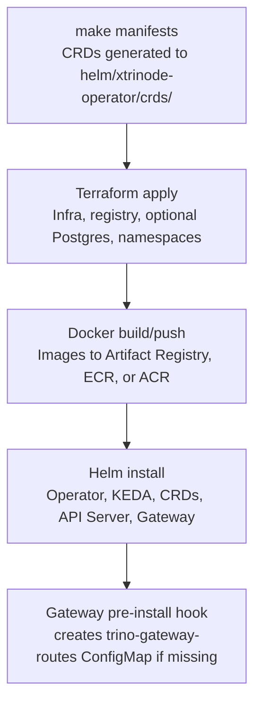

# XTrinode Deployment Guide

Deployment flow for XTrinode. The GCP/GKE path is the current fully exercised
cloud path; AWS/EKS and Azure/AKS are experimental provider-validation paths and
should not be read as production-hardened or parity-tested yet.

---

## Deployment Flow Overview



### Key points

- **CRDs** are generated by `make manifests` and live in the Helm chart. The cloud deploy scripts apply them
  explicitly before Helm because Helm installs CRDs only on first install and does not upgrade existing CRDs.
- **Gateway ConfigMap** (`trino-gateway-routes`) is created by a Helm pre-install hook if it doesn't exist. The operator
  populates it when XTrinode CRs exist.
- **API server exposure** stays internal by default. Cloud deploy scripts keep the API server as a ClusterIP service,
  enable admin and resume-only bearer tokens, and configure the Gateway with the resume-only token.
- `make deploy-gcp`, `make deploy-aws`, and `make deploy-azure` run Helm repo setup before chart dependency
  resolution, so a fresh Helm config can resolve KEDA, kube-prometheus-stack, and Trino dependencies. Only the GCP
  path currently has full live smoke coverage.

### Provider support posture

- GCP has the complete checked-in and exercised path today: Terraform, deployment automation, CAPG bootstrap,
  CAPG managed nodepool smoke coverage, and KEDA/resume smoke coverage.
- AWS and Azure have Terraform modules, registry-backed deploy scripts, API-server auth wiring, and
  unit-tested nodepool resource generation, but they are experimental and not thoroughly live-smoke validated yet.

### API server exposure posture

The API server is an internal control-plane service for operator, Gateway, and trusted automation
calls. Do not expose it directly to browsers, tenants, or public users. If an operator deliberately
adds API-server ingress for restricted administrative access, Helm requires bearer auth, TLS, and
exact non-wildcard CORS origins, and tenant-aware authorization is still not implemented.

---

## GCP (GKE)

### Prerequisites

- `gcloud` CLI authenticated
- `gke-gcloud-auth-plugin` (for kubectl)
- Helm 3.x
- Terraform (for infra)
- Docker (for building images)

### Quick Deploy (infra + images already exist)

```bash
make deploy-gcp
```

Runs `scripts/deploy-gcp.sh`, which:

1. Configures kubectl for the GKE cluster
2. Creates namespaces (`xtrinode-system`, `xtrinode-gateway`)
3. Runs `make manifests` (CRDs → helm chart)
4. Ensures Helm repositories are configured, then updates Helm dependencies
5. Deploys observability when enabled
6. Deploys operator, API server, gateway via Helm

### Full Deploy (from scratch)

```bash
# Optional: review the GCP plan first
make terraform-plan-gcp

# 1. Provision the GKE management cluster and Kubernetes/cloud add-ons
make gcp-management-up

# 2. Build and push images
make gcp-images-push

# 3. Deploy operator, API server, and gateway via Helm
make gcp-control-plane-deploy
```

Use `make deploy-gcp` when the GKE cluster and images already exist and you want the deploy script
directly. `make gcp-control-plane-deploy` is the runbook target used by the from-zero GCP/CAPG flow.
Run `make gcp-flow` to print the complete ordered CAPG runbook.

### Environment Variables

| Variable | Default | Description |
|----------|---------|-------------|
| `GCP_PROJECT_ID` | project-40642592-0c4f-4ce1-9d6 | GCP project |
| `GCP_CLUSTER_NAME` | xtrinode-gke-test | GKE cluster name |
| `GCP_ZONE` | us-central1-a | GKE zone |
| `VERSION` | 0.1.0 | Image tag |
| `OPERATOR_NAMESPACE` | xtrinode-system | Namespace for operator + API server |

---

## AWS (EKS)

### Prerequisites

- AWS CLI configured
- Terraform
- Docker
- Helm 3.x
- kubectl

### Full Deploy (from scratch)

```bash
make deploy-aws
```

Runs `scripts/deploy-aws.sh`, which is intended for provider validation and handles:

1. Terraform (VPC, EKS, ECR, optional RDS, etc.)
2. Docker build and push to ECR
3. `make manifests` (CRDs)
4. API server admin and resume-only token Secrets
5. Helm deploy (operator, API server, gateway, optional observability)

The AWS script enables public EKS API access restricted to the caller's current
`/32` IP so local kubectl and Helm can complete. It prints the follow-up command
to disable public access after testing.

### Split Deploy

Use the split form when debugging one phase or when infrastructure/images are already present:

```bash
make terraform-plan-aws
make terraform-apply-aws
bash scripts/deploy-aws.sh --skip-terraform
```

If images are already in ECR:

```bash
bash scripts/deploy-aws.sh --skip-build
```

### Skip Options

```bash
./scripts/deploy-aws.sh --skip-terraform   # Infra exists, build + helm only
./scripts/deploy-aws.sh --skip-build       # Images exist, terraform + helm only
```

Key environment variables:

| Variable | Default | Description |
|----------|---------|-------------|
| `AWS_PROFILE` | default | AWS CLI profile |
| `AWS_REGION` | us-east-1 | AWS region |
| `CLUSTER_NAME` | xtrinode-eks-test | EKS cluster name |
| `VERSION` | chart appVersion | Image tag |
| `POSTGRES_ENABLED` / `TF_VAR_postgres_enabled` | false | Enable RDS PostgreSQL catalog-test infrastructure |
| `PROMETHEUS_ENABLED` | false | Install observability and render ServiceMonitors |
| `VECTOR_ENABLED` | false | Install Vector through the observability chart |
| `GATEWAY_REDIS_ENABLED` | false | Enable Redis-backed gateway state |

---

## Azure (AKS)

### Prerequisites

- Azure CLI authenticated with `az login`
- Terraform
- Docker
- Helm 3.x
- kubectl
- Network path to the AKS API server. The Terraform defaults create a private
  cluster, so run the Helm portion from the VNet, VPN, bastion, or an equivalent
  private access path.

### Full Deploy (from scratch)

```bash
make deploy-azure
```

Runs `scripts/deploy-azure.sh`, which is intended for provider validation and handles:

1. Terraform (resource group, VNet, AKS, ACR, optional PostgreSQL, etc.)
2. Docker build and push to ACR
3. `make manifests` (CRDs)
4. API server admin and resume-only token Secrets
5. Helm deploy (operator, API server, gateway, optional observability)

The Azure Terraform defaults create a private AKS cluster, so the Helm portion
must run from a network path that can reach the AKS API server.

### Split Deploy

Use the split form when debugging one phase or when infrastructure/images are already present:

```bash
make terraform-plan-azure
make terraform-apply-azure
bash scripts/deploy-azure.sh --skip-terraform
```

If images are already in ACR:

```bash
bash scripts/deploy-azure.sh --skip-build
```

### Skip Options

```bash
./scripts/deploy-azure.sh --skip-terraform   # Infra exists, build + helm only
./scripts/deploy-azure.sh --skip-build       # Images exist, terraform + helm only
```

Key environment variables:

| Variable | Default | Description |
|----------|---------|-------------|
| `AZURE_SUBSCRIPTION_ID` | active Azure CLI subscription | Azure subscription |
| `AZURE_REGION` | eastus | Azure region |
| `RESOURCE_GROUP_NAME` | xtrinode-rg | Azure resource group |
| `CLUSTER_NAME` | xtrinode-aks-test | AKS cluster name |
| `ACR_LOGIN_SERVER` | Terraform output | ACR login server override |
| `VERSION` | chart appVersion | Image tag |
| `POSTGRES_ENABLED` / `TF_VAR_postgres_enabled` | false | Enable Azure PostgreSQL catalog-test infrastructure |
| `PROMETHEUS_ENABLED` | false | Install observability and render ServiceMonitors |
| `VECTOR_ENABLED` | false | Install Vector through the observability chart |
| `GATEWAY_REDIS_ENABLED` | false | Enable Redis-backed gateway state |

---

## Generic / Local Deploy

For Kind or any cluster with images from `ghcr.io/xtrinode`:

```bash
make deploy                    # Uses xtrinode-system, xtrinode-gateway, ghcr.io/xtrinode
make deploy-local              # Local images (dev tag) for Kind
```

---

## Makefile Targets Summary

| Target | Description |
|--------|-------------|
| `make manifests` | Generate CRDs to helm chart (run before deploy if API types changed) |
| `make deploy` | Deploy operator + API server + gateway (generic config) |
| `make terraform-plan-gcp` | Plan the GCP Terraform deployment |
| `make terraform-apply-gcp` | Apply the GCP Terraform deployment |
| `make gcp-management-up` | Create the GCP management cluster and Kubernetes/cloud add-ons |
| `make gcp-images-push` | Build and push operator, API server, and gateway images to GCP Artifact Registry |
| `make gcp-control-plane-deploy` | Deploy operator, API server, and gateway to the GCP management cluster |
| `make deploy-gcp` | Full GCP deploy via scripts/deploy-gcp.sh |
| `make deploy-aws` | Experimental AWS provider-validation deploy via scripts/deploy-aws.sh |
| `make deploy-azure` | Experimental Azure provider-validation deploy via scripts/deploy-azure.sh |
| `make deploy-local` | Deploy with local images (Kind) |
| `make undeploy` | Remove all Helm releases |

---

## Verify Deployment

```bash
kubectl get pods -n xtrinode-system
kubectl get pods -n xtrinode-gateway
kubectl get crd | grep xtrinode
```

---

## Troubleshooting

- **Gateway CrashLoopBackOff**: Ensure `trino-gateway-routes` ConfigMap exists. The pre-install hook creates it; if it
  failed, create manually: `kubectl create configmap trino-gateway-routes -n xtrinode-gateway
  --from-literal=routes.yaml="routes: []"`
- **Operator "no matches for kind XTrinode"**: CRDs not installed. Reinstall operator (Helm installs CRDs only on first
  install): `helm uninstall xtrinode-operator -n xtrinode-system && make deploy-gcp`
- **ImagePullBackOff**: Verify registry auth and that images exist. For private GKE nodes, ensure Cloud NAT is
  configured for external pulls.
